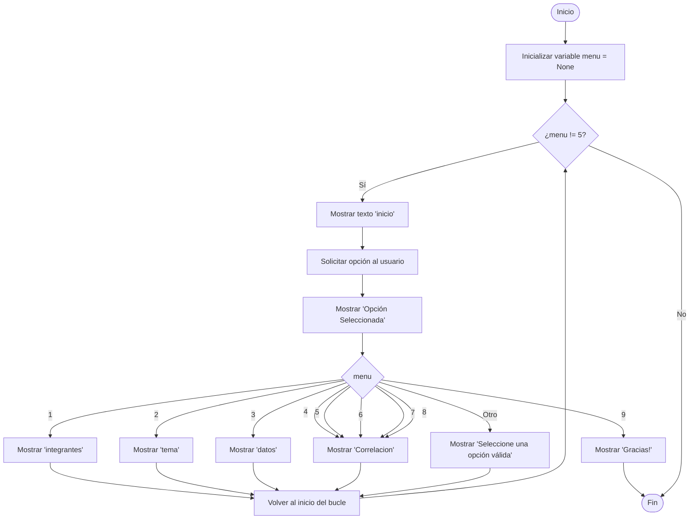

# Integrantes
1. Ricardo Flores ven
2. Andrés Guzmán col
3. Rocio Belen Ruiz Diaz
# Tema
Tienda retail Aurelion
# Problema
**Planificación deficiente y nula segmentación de clientes en Tienda Aurelion.**

La tienda opera sin una planificación de ventas estructurada, lo que desencadena una gestión de inventario imprecisa. De forma paralela, su enfoque comercial es indiferenciado, tratando a todos los clientes por igual. Esta falta de segmentación impide diseñar estrategias de marketing eficientes y personalizadas que realmente conecten con los consumidores e impulsen la demanda.
# Solución
1. Normalizar la bases de datos.
2. Identificar y definir las variables clave necesarias para alimentar los modelo
3. Desarrollar modelos de Machine Learning para la segmentacion automatica de clientes y la prediccion de la demanda
4. Implementar un Dashboard para visualizar y monitorear los KPI de la tienda
# Dataset
**Productos**
Atributo | Tipo de dato | Escala de medición | Identificadores
-|-|-|-
id_producto | Int | intervalo | PK
nombre_producto | strings | nominal | 
categoria | strings | nominal |
precio_unitario | float | razón |

**Clientes**
Atributo | Tipo de dato | Escala de medición | Identificadores
-|-|-|-
id_cliente | int | intervalo | PK
nombre_cliente | strings | nominal | 
email | strings | nominal | 
ciudad | strings | nominal |
fecha_alta | date | intervalo |

 **Ventas**
Atributo | Tipo de dato | Escala de medición | Identificadores
-|-|-|-
 id_venta | int | intervalo | PK
 fecha	| date | intervalo |
 id_cliente	| int | intervalo | FK 
 nombre_cliente	| strings | nominal | 
 apellido_cliente	| strings | nominal | 
 email | strings | nominal |
 medio_pago | strings | nominal |

 **Detalle_ventas**
Atributo | Tipo de dato | Escala de medición | Identificadores
-|-|-|-
id_venta | int | intervalo | FK
id_producto | int | intervalo | FK
nombre_producto | string | nominal |
cantidad | int | razón |
precio_unitario |	float | razón |
importe | float | razón | 
 
# Pseudocodigo
Inicio
- 1. Mostrar un menú interactivo con las siguientes opciones:
1. Consultar integrantes
2. Consultar Tema, problema y solución
3. Consultar Datasets
4. consultar psudocodigos
5. consultar tablas
6. consultar Estadisticas
7. generar graficos
8. consultar correlación
9. salir

- 2. Mientras el usuario no elija la opción "Salir":
a. Leer la opción ingresada.
b. Si la opción es válida:

- 3. Ejecutar la acción correspondiente.

- 4. Mostrar los resultados en la consola.
c. Si la opción no es válida:

- 5. Mostrar un mensaje de error indicando que la opción no existe.

- 6.  Finalizar la ejecución del programa.

Fin

# Diagrama del programa

